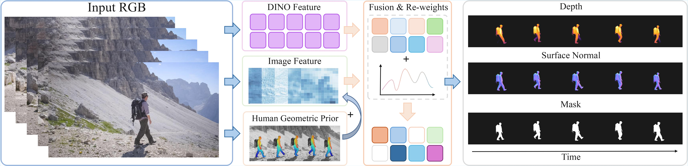

# From Frames to Sequences: Temporally Consistent Human-Centric Dense Prediction

[](https://xingy038.github.io/F2S/)
[](https://arxiv.org/abs/2602.04439)

The official implementation for F2S.



In this work, we focus on the challenge of temporally consistent human-centric dense prediction across video sequences. Existing models achieve strong per-frame accuracy but often flicker under motion, occlusion, and lighting changes, and they rarely have paired human video supervision for multiple dense tasks.

We address this gap with a scalable synthetic data pipeline that generates photorealistic human frames and motion-aligned sequences with pixel-accurate depth, normals, and masks. Unlike prior static data synthetic pipelines, our pipeline provides both frame-level labels for spatial learning and sequence-level supervision for temporal learning.

Building on this, we train a unified ViT-based dense predictor that (i) injects an explicit human geometric prior via CSE embeddings and (ii) improves geometry-feature reliability with a lightweight channel reweighting module after feature fusion. Our two-stage training strategy, combining static pretraining with dynamic sequence supervision, enables the model first to acquire robust spatial representations and then refine temporal consistency across motion-aligned sequences.

Extensive experiments show that we achieve state-of-the-art performance on THuman2.1 and Hi4D and generalize effectively to in-the-wild videos.

## 🛠️ Installation

Install the base Python dependencies:

```bash
git clone https://github.com/xingy038/F2S.git
cd F2S
pip install -r requirements.txt
```

The model also depends on Detectron2 and DensePose because the CSE positional encoder is executed at runtime.

Recommended environment setup:

1. Install PyTorch and torchvision for your CUDA version.
2. Install Detectron2 compatible with that PyTorch build.
3. Make DensePose importable, for example:

```bash
export PYTHONPATH=/path/to/detectron2/projects/DensePose:$PYTHONPATH
```

### External Assets

This release does not bundle pretrained weights. Place the following files under `checkpoints/`:

| File | Usage |
| --- | --- |
| `dinov3_vitb16_pretrain_lvd1689m-73cec8be.pth` | [DINOv3 ViT-B backbone initialization](https://github.com/facebookresearch/dinov3) |
| `dinov3_vitl16_pretrain_lvd1689m-8aa4cbdd.pth` | [DINOv3 ViT-L backbone initialization](https://github.com/facebookresearch/dinov3) |
| `model_final_e96218.pkl` | [DensePose CSE detector weights](https://dl.fbaipublicfiles.com/densepose/cse/densepose_rcnn_R_50_FPN_DL_s1x/251156349/model_final_e96218.pkl) |
| `phi_smpl_27554_256.pkl` | [DensePose CSE embedder weights](https://dl.fbaipublicfiles.com/densepose/data/cse/lbo/phi_smpl_27554_256.pkl) |

The default script arguments assume this layout.

## 💾 Dataset Protocol

### Real Human Training Set

`train_static.py` expects split entries of the form:

```text
<subset>/<scene>/<camera_dir>_<frame_id>
```

and reads data from:

```text
<train_root>/<subset>/<scene>/<camera_dir>/
  camera_params.json
  image/rgba_<frame_id>.jpg
  depth/depth_<frame_id>.exr
  normal/normal_<frame_id>.png
  mask/mask_<frame_id>.png
```

### Validation Set

`train_static.py` expects validation split entries of the form:

```text
<scene>_<frame_id>
```

and reads data from:

```text
<val_root>/
  image/<scene>/<frame_id>.jpg
  depth/<scene>/<frame_id>.exr
  normal/<scene>/<frame_id>.png
  mask/<scene>/<frame_id>.png
```

### SynthHuman

If optional synthetic supervision is used, each split entry only needs a stem containing an index, for example:

```text
sample_000001
```

The loader resolves that entry to:

```text
<synth_root>/
  rgb_000001.png
  alpha_000001.png
  depth_000001.exr
  normal_000001.exr
  cam_000001.txt
```

### Dynamic / Video Data

`train_video.py` expects split entries of the form:

```text
dynamic/<sequence>/<scene>_<frame_id>
```

and reads data from:

```text
<data_root>/dynamic/<sequence>/<scene>/
  image/rgba_<frame_id>.jpg
  depth/depth_<frame_id>.exr
  normal/normal_<frame_id>.png
  mask/mask_<frame_id>.png
```

## 🚀 Training

### Stage I: Static Model

ViT-L example:

```bash
python train_static.py \
  --encoder vitl \
  --train-list /path/to/all_sample.txt \
  --train-root /path/to/DATA \
  --synth-list /path/to/SynthHuman_sample.txt \
  --synth-root /path/to/SynthHuman \
  --val-list /path/to/test_sample_HI4D.txt \
  --val-root /path/to/HI4D \
  --pretrained-backbone checkpoints/dinov3_vitl16_pretrain_lvd1689m-8aa4cbdd.pth \
  --save-path outputs/static_vitl
```

ViT-B example:

```bash
python train_static.py \
  --encoder vitb \
  --train-list /path/to/all_sample.txt \
  --train-root /path/to/DATA \
  --val-list /path/to/test_sample_HI4D.txt \
  --val-root /path/to/HI4D \
  --pretrained-backbone checkpoints/dinov3_vitb16_pretrain_lvd1689m-73cec8be.pth \
  --save-path outputs/static_vitb
```

### Stage II: Temporal Model

The temporal model is initialized from a trained static checkpoint:

```bash
python train_video.py \
  --encoder vitl \
  --video-list /path/to/dynamic_sample.txt \
  --data-root /path/to/DATA \
  --static_ckpt checkpoints/static_vitl.pt \
  --save-path outputs/dynamic_vitl
```

To finetune the backbone together with the temporal modules:

```bash
python train_video.py \
  --encoder vitl \
  --video-list /path/to/dynamic_sample.txt \
  --data-root /path/to/DATA \
  --static_ckpt checkpoints/static_vitl.pt \
  --no-freeze-backbone \
  --save-path outputs/dynamic_vitl
```

## 🕹️ Inference

### Pretrained weights

| File | Download |
| --- | --- |
| `Image vitb` | [model](https://drive.google.com/file/d/1iTBx8V_GqSuB_-xGampM0T-tYI2dOQvm/view?usp=sharing) |
| `Image vitl` | [model](https://drive.google.com/file/d/1eSrid0FZ5SqEux4_GQS6v8T14ev6lPuI/view?usp=sharing) |
| `Video vitb` | [model](https://drive.google.com/file/d/1iTBx8V_GqSuB_-xGampM0T-tYI2dOQvm/view?usp=sharing) |
| `Video vitl` | [model](https://drive.google.com/file/d/1E6hjzff2jcGmkmT91GBECDzCsRC9SfVf/view?usp=sharing) |

### Image Inference

```bash
python infer_static.py \
  --encoder vitl \
  --ckpt checkpoints/static_vitl.pt \
  --input_path /path/to/images \
  --output_path /path/to/results
```

Predictions are written to:

```text
<output_path>/
  depth/
  normal/
  mask/
```

### Video Inference

```bash
python infer_video.py \
  --encoder vitl \
  --ckpt checkpoints/dynamic_vitl.pt \
  --input_path /path/to/sequence_root \
  --output_path /path/to/video_results
```

Predictions are written to:

```text
<output_path>/
  depth/<sequence_name>/*.png
  normal/<sequence_name>/*.png
  mask/<sequence_name>/*.png
```

## 🎓 BibTeX

If you find F2S useful, please cite:

```bibtex
@article{F2S,
      title={From Frames to Sequences: Temporally Consistent Human-Centric Dense Prediction}, 
      author={Xingyu Miao and Junting Dong and Qin Zhao and Yuhang Yang and Junhao Chen and Yang Long},
      year={2026},
      eprint={2602.01661},
      archivePrefix={arXiv},
      primaryClass={cs.CV},
      url={https://arxiv.org/abs/2602.01661}, 
      }
```

## Acknowledgement

This project would not be possible without many excellent open-source codebases. Notable examples include [Dino3](https://github.com/facebookresearch/dinov3), [VDA](https://github.com/DepthAnything/Video-Depth-Anything), and [DensePose](https://github.com/facebookresearch/detectron2/tree/main/projects/DensePose), among others.

## Contact

**Email:** xingyu.miao@durham.ac.uk